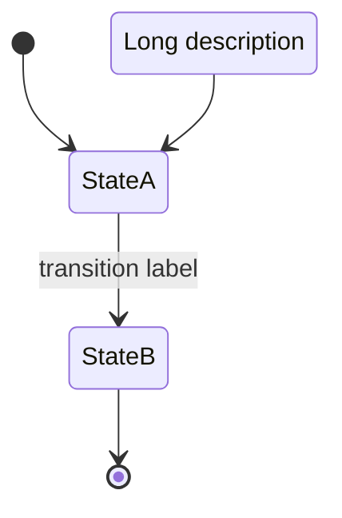

# State Diagram Plugin Design

## Overview

Add state diagram support to Figurehead, following Mermaid.js `stateDiagram-v2` syntax.

## Scope (MVP)

**Included:**
- Basic states with labels
- Start/end terminal states (`[*]`)
- Transitions with optional labels
- State declarations with descriptions (`state "desc" as id`)
- Top-down layout

**Excluded (future work):**
- Composite/nested states
- Fork/join, choice nodes
- Notes
- Direction directive

## Architecture

Standard Figurehead pipeline:

```
stateDiagram-v2 input → Detector → Parser → Database → Layout → Renderer → ASCII
```

### File Structure

```
crates/figurehead/src/plugins/state/
├── mod.rs          # StateDiagram struct, re-exports
├── detector.rs     # Detects "stateDiagram" keyword
├── parser.rs       # Chumsky parser for state syntax
├── database.rs     # Stores states + transitions using core types
├── layout.rs       # Grid-based positioning
└── renderer.rs     # ASCII box drawing
```

### Core Type Reuse

- `NodeData` for states (with new `NodeShape::Terminal` for `[*]`)
- `EdgeData` for transitions
- `EdgeType::Arrow` for `-->`
- `Direction` for layout direction
- `CharacterSet` for ascii/unicode rendering

## Syntax Support



### Parser Components

1. **Header** - `stateDiagram` or `stateDiagram-v2`
2. **Terminal state** - `[*]` → `NodeShape::Terminal`
3. **State reference** - identifier like `StateA`
4. **State declaration** - `state "description" as id`
5. **Transition** - `from --> to` or `from --> to : label`
6. **Comments** - `%%` lines skipped

## Layout

Rank-based grid layout:
1. Start state `[*]` at rank 0
2. BFS from start, assign ranks by distance
3. States at same rank in same row
4. Default direction: top-down

## Rendering

States as boxes:
```
┌─────────┐
│ StateA  │
└─────────┘
```

Terminal states:
```
Start: (●)
End:   (○)
```

Transitions as arrows:
```
    │
    │ label
    ▼
```

## Implementation Order

1. Add `NodeShape::Terminal` to `core/types.rs`
2. Create `state/` plugin skeleton
3. Database - implement `Database` trait with `NodeData`/`EdgeData`
4. Parser - chumsky parser
5. Layout - rank-based grid
6. Renderer - ASCII output
7. Wire into orchestrator

## Test Cases

- Empty diagram
- Single state
- Two states with transition
- Start → State → End flow
- Transition labels
- State with description
- Multiple transitions from one state
- Unicode vs ASCII rendering

## Success Criteria

Input:
```
stateDiagram-v2
    [*] --> Idle
    Idle --> Processing : start
    Processing --> Done : complete
    Done --> [*]
```

Output:
```
    (●)
     │
     ▼
┌─────────┐
│  Idle   │
└─────────┘
     │ start
     ▼
┌────────────┐
│ Processing │
└────────────┘
     │ complete
     ▼
┌─────────┐
│  Done   │
└─────────┘
     │
     ▼
    (○)
```
